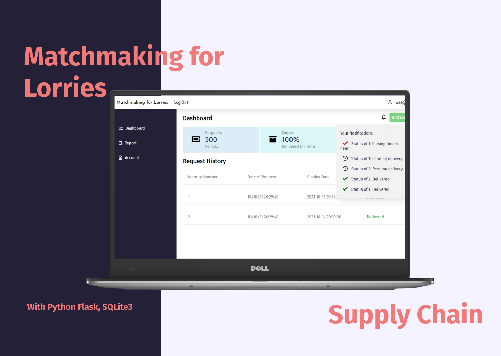

# Matchmaking For Lorries
Cargo delivery request web application for warehouse operators, that allows efficient co-loading, optimize truck load per trip, and reduce lorry traffic.<br>
Done by Jolene and Shi Qi as a part of 2021 PSA Codesprint 3 day Hackathon.<br>
Demo Video/Pitch: https://youtu.be/SqU1l4PxwK8

## Usage
Import the necessary Python Libraries as listed below

```
python main.py

you can login with the following user details
email: demo2@gmail.com
password: demo2pw34
or
email: demo@gmail.com
password: demopw34
or
create a new account at sign-up page
```

## Tech Stack
- Flask
- SQLite3
- HTML/CSS, Javascript
- Python Libraries: apscheduler, openpyxl, pandas, flask_login, datetime, pytz, flask_sqlachemy, sqlalchemy, os, werkzeug

## Main Features
- Pair cargo loads together as delivery requests and then connect both requests with a lorry that will be assigned to transport both, removing the need for another lorry 


## How it works
We made use of Python, as our backend programming language, as well as sqlite, as our database to store all the delivery requests, the operators, the location of warehouses, as well as the lorries deployed at the Container Freight Station. The operators each have an account that they use, to send delivery requests for co-loading with other operators. These requests are sent to our database, and prioritized according to their closing time. The pairing of requests is also optimized by the start and end location of the cargo. We used a shortest path algorithm of a graph data structure, to find requests that are closest to each other. Cargos that can be picked up on the way to the end location are also prioritized. Paired requests are then matched with a lorry that can be filled to at least 80% of its total cargo load, hence optimizing the usage of lorries for delivery. 
In the case where a request does not manage to find another most suitable request to co-load with, the operator is alerted through a notification that sent 2 hours before the closing time is reached. This provides sufficient time for the operator to find other means of delivery. In addition to increasing the efficiency of co-loading, we also enabled each operator to download a report of their cargo deliveries made through our web application.

## Contact
Jolene - [jolenechong7@gmail.com](mailto:jolenechong7@gmail.com) <br>
Shi Qi - [pshiqi01@gmail.com](mailto:pshiqi01@gmail.com)
